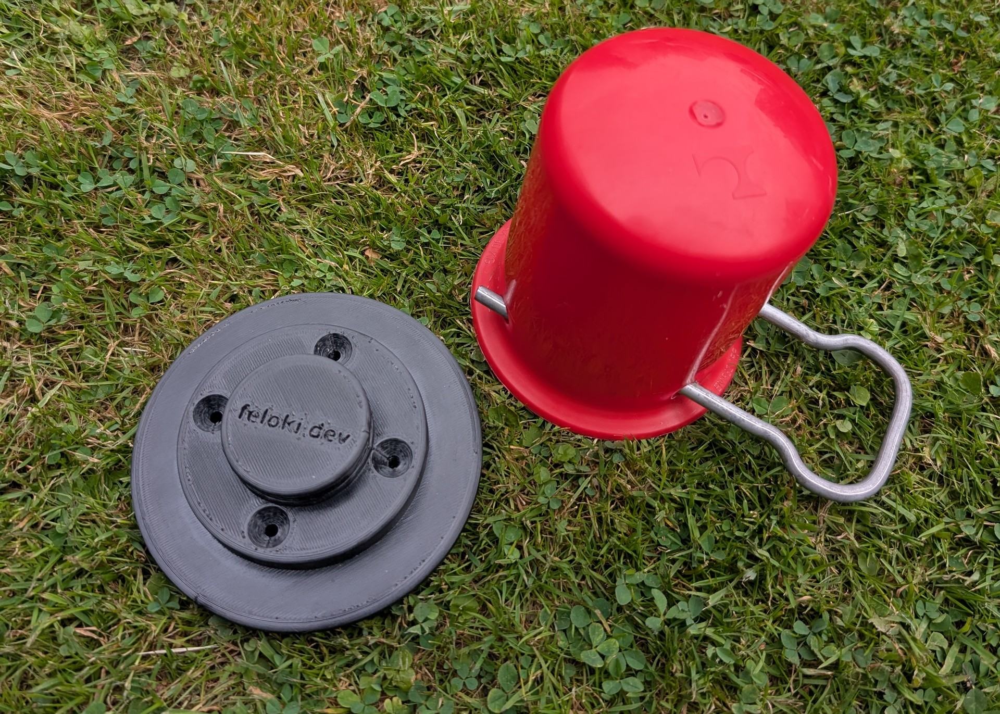
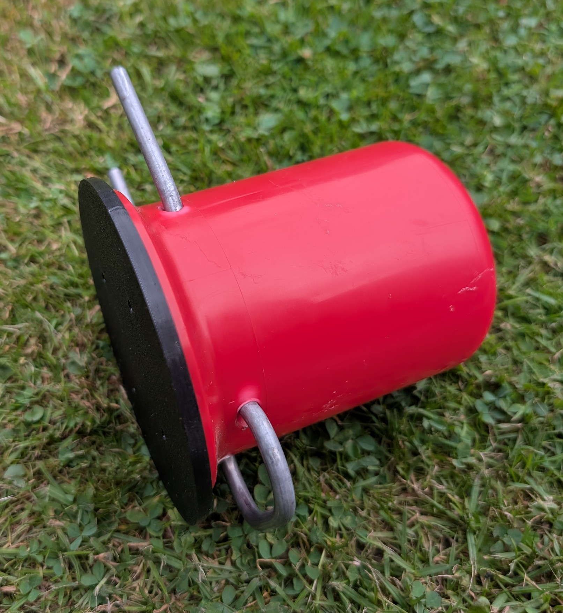

# Gaskappenhalter

Dies ist ein 3D-Druckmodell (step/stl), für einen Halter für den Deckel von den typischen deutschen 5 und 11kg Gasflaschen, mit meist roter Plastikappe. So fliegt die Kappe hinterher nicht lose im Gaskasten herum.

## Funktion:

Der Gaskappenhalter hält die Kappe über den Klemmechanismus der Kappe, hierduch kann man ihn in beliebiger Richtung installieren:

## Lizenz:

Copyright FeLoki.dev 2026.

This source describes Open Hardware and is licensed under the CERN-OHL-P
v2
You may redistribute and modify this documentation and make products
using it under the terms of the CERN-OHL-P v2 (https:/cern.ch/cern-ohl).
This documentation is distributed WITHOUT ANY EXPRESS OR IMPLIED
WARRANTY, INCLUDING OF MERCHANTABILITY, SATISFACTORY QUALITY
AND FITNESS FOR A PARTICULAR PURPOSE. Please see the CERN-OHL-P v2
for applicable conditions

