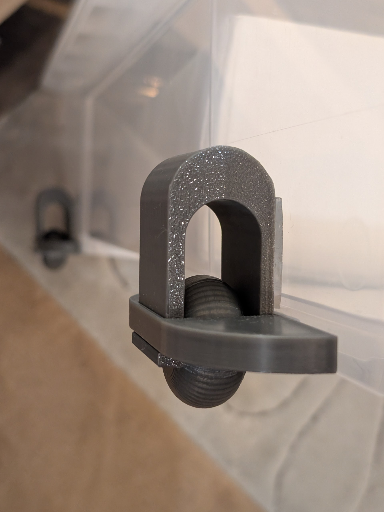
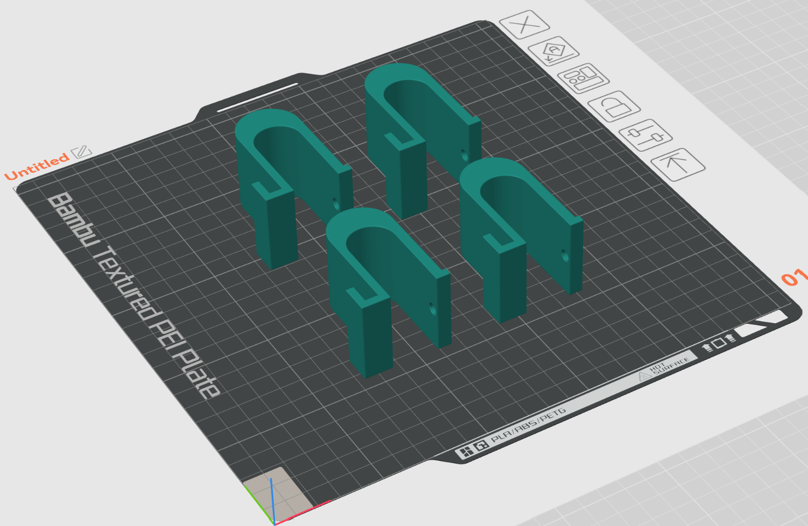
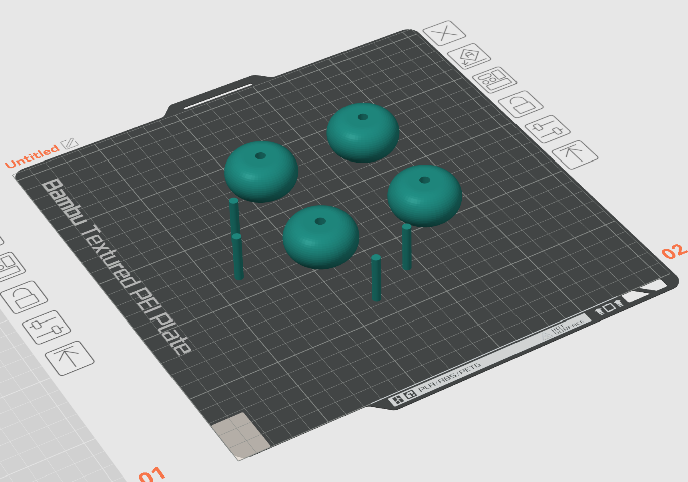
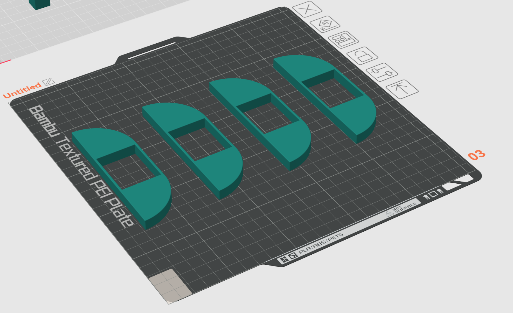

# WheelsFor78x56x18cmSamlaBox:

This are my self-designed wheels for a 78x56x18cm Samla box.

It's not wider than the cover of the box, so you can put to boxes next to each other.

## What you need:

- about 200g PETG-filament and a 3d printer 
- 160mm (4x40mm)  double-sided adhesive tape (2mm thick, 30mm wide)

## How to print:

- 3 walls
- 20% infill
- use grid supports for the wheels
- use a brim for the clamp and the axes
- clamp around can be printed without brim

## Print orientations:

### Clamp print orientation:

### Wheels and axes print orientation:

### Clamp around print orientation:

## How to install:

Put the parts together.

Then hang in the roll at the bottom edge of the box and push the wheel sideways against the box, so the adhesive tape touches the box.

## License:

License CC BY-SA 4.0 Feloki

https://creativecommons.org/licenses/by-sa/4.0

